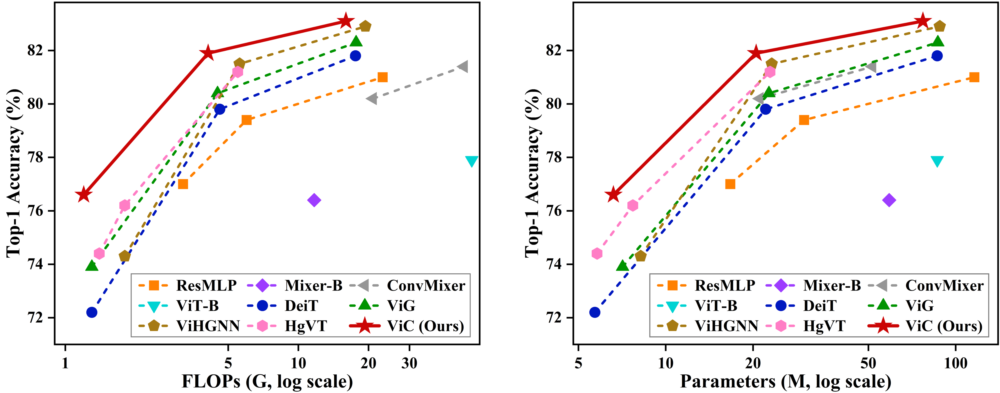
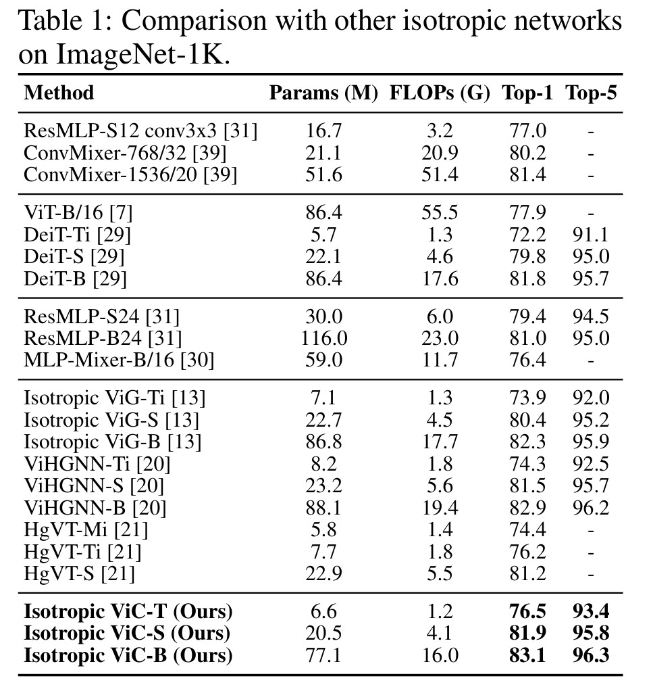
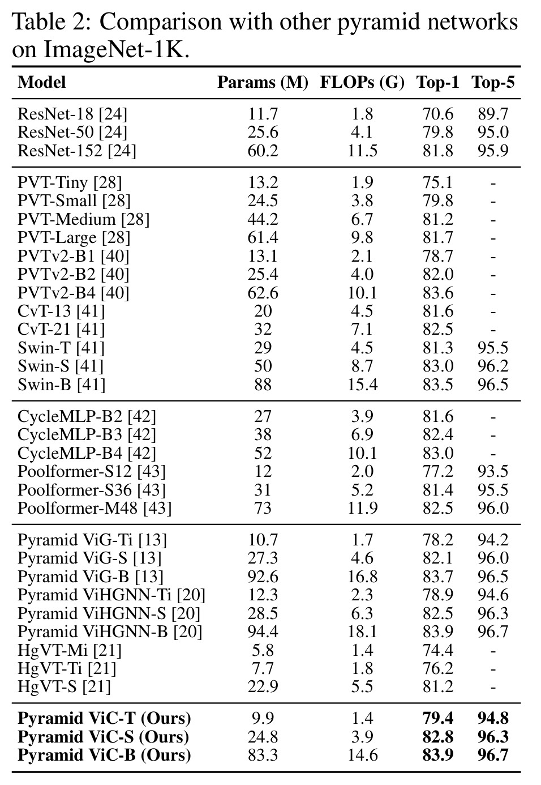

<h2 align="center">🕸️ Vision Correlators: Correlation-Driven Visual Understanding with Hypergraphs</h2>

<p align="center"><b>🔥 Our paper has been accepted to NeurIPS 2026!</b></p>

<div align="center">
    
</div>

**Figure 1. Accuracy-efficiency comparison of Vision Correlator with representative visual backbones.**

## Overview🔍

Introducing **Vision Correlator (ViC)**, a hypergraph-based visual backbone for correlation-driven visual understanding. ViC moves beyond pairwise token interactions and explicitly models high-order semantic correlations among multiple visual regions, components, and semantic entities.

**Correlation Induction-Correlation Propagation**

- Reformulates visual understanding as inducing multi-order correlation structures and propagating information across them.
- Covers both local 2-order correlations and global beyond-pairwise semantic correlations.
- Provides a unified hypergraph-based framework for visual correlation modeling.

**Anchor-based Hypergraph Generation**

- Treats each visual token as a local token anchor and induces local correlations through nearest-neighbor queries.
- Introduces learnable semantic anchors as semantic centers to generate global high-order hyperedges.
- Incorporates topological information to build scalable hypergraph structures across semantic scales.

**Differential Mixed Aggregation**

- Constructs hyperedge representations from the induced global hyperedges.
- Unifies local neighbor differences and global hyperedge-level semantic differences in one vertex update.
- Uses hyperedge dropout during training to improve the stability and robustness of structure learning.

ViC is instantiated as **Isotropic ViC** for constant-resolution visual backbones and **Pyramid ViC** for hierarchical multi-scale representations, achieving a favorable accuracy-efficiency trade-off against strong Transformer and graph-based baselines.

## ImageNet Results🏆


<div align="center">
  <table>
    <tr>
      <td align="center" width="50%">
        
      </td>
      <td align="center" width="50%">
        
      </td>
    </tr>
    <tr>
      <td align="center"><b>Figure 2. ImageNet-1K results of Isotropic ViC.</b></td>
      <td align="center"><b>Figure 3. ImageNet-1K results of Pyramid ViC.</b></td>
    </tr>
  </table>
</div>

## Model Zoo📦

Download the ViC model weights trained on ImageNet-1K from [Google Drive](https://drive.google.com/drive/folders/1bj0eMlW_oFgyt5ZZdlp9-qDJNwYzKWWN).

### Isotropic ViC on ImageNet-1K

| Method | Size | Acc-Top1 (%) | #Params (M) |
| :--- | :---: | :---: | :---: |
| ViC-T | 224 | 76.5 | 6.6 |
| ViC-S | 224 | 81.9 | 20.5 |
| ViC-B | 224 | 83.1 | 77.1 |

### Pyramid ViC on ImageNet-1K

| Method | Size | Acc-Top1 (%) | #Params (M) |
| :--- | :---: | :---: | :---: |
| Pyramid ViC-T | 224 | 79.4 | 9.9 |
| Pyramid ViC-S | 224 | 82.8 | 24.8 |
| Pyramid ViC-B | 224 | 83.9 | 83.3 |

## Getting Started🚀

### 1. Environment Setup

Create a conda environment and install the dependencies:

```bash
conda create -n vic python=3.9 -y
conda activate vic
pip install -r requirements.txt
```

The dependency list is intentionally minimal. Please install the PyTorch build that matches your CUDA version if the default pip resolver does not select the desired CUDA wheel.

### 2. Data Preparation

The code uses `timm.data.ImageDataset`. Prepare ImageNet in the standard ImageFolder format:

```text
DATA_ROOT/
  train/
    class_0001/
      xxx.JPEG
    class_0002/
      xxx.JPEG
  validation/
    class_0001/
      xxx.JPEG
    class_0002/
      xxx.JPEG
```

For validation, the code first checks `DATA_ROOT/val-classify`. If it does not exist, it uses `DATA_ROOT/validation`.

### 3. Training

Training is launched directly with `train.sh`:

```bash
DATA_ROOT=/path/to/imagenet \
CUDA_VISIBLE_DEVICES=0,1,2,3,4,5,6,7 \
NPROC_PER_NODE=8 \
bash train.sh
```

The default `train.sh` trains `vic_ti_224_gelu` with the released hyperparameters. Important fields in the script are:

- `DATA_ROOT`: ImageNet root directory.
- `CUDA_VISIBLE_DEVICES`: visible GPU IDs.
- `NPROC_PER_NODE`: number of distributed processes, usually equal to the number of GPUs.
- `model`: model name, such as `vic_ti_224_gelu` or `pvic_b_224_gelu`.
- `batch_size`: per-process batch size.
- `epochs`: total training epochs.
- `lr`, `weight_decay`, `warmup_epochs`: optimizer and scheduler settings.
- `mixup`, `cutmix`, `aa`, `reprob`, `repeated-aug`: data augmentation settings.
- `k`: initial local KNN size. The code increases it with depth.
- `num_hyperedges`: initial number of semantic anchors. The code increases it with depth.
- `laplacian_alpha`: structure induction coefficient.
- `enable_hyperedge_dropout`: whether to enable hyperedge dropout.
- `output_path`: output directory for logs and checkpoints.

To switch from the default Isotropic ViC to Pyramid ViC, change:

```bash
model="vic_ti_224_gelu"
```

to one of:

```bash
model="pvic_ti_224_gelu"
model="pvic_s_224_gelu"
model="pvic_b_224_gelu"
```

To switch among Isotropic ViC sizes, use:

```bash
model="vic_ti_224_gelu"
model="vic_s_224_gelu"
model="vic_b_224_gelu"
```

When changing model size, you may also adjust `batch_size`, `drop_path`, and `NPROC_PER_NODE` according to GPU memory. The script keeps the released code settings by default.

Training outputs are written to:

```text
<output_path>/train/<timestamp>-<model>-<image_size>/
```

Each run saves `args.yaml`, `summary.csv`, and checkpoints.

### 4. Testing

Evaluate a checkpoint with `test.sh`:

```bash
DATA_ROOT=/path/to/imagenet \
CHECKPOINT=/path/to/checkpoint.pth.tar \
CUDA_VISIBLE_DEVICES=0 \
NPROC_PER_NODE=1 \
bash test.sh
```

Make sure the `model` variable in `test.sh` matches the checkpoint architecture. For example, use `vic_ti_224_gelu` for an Isotropic ViC-Ti checkpoint and `pvic_b_224_gelu` for a Pyramid ViC-B checkpoint.

`test.sh` automatically checks whether the checkpoint contains `state_dict_ema`. If EMA weights are available, EMA evaluation is enabled.

## Supported Models💡

The following model names are registered through `timm` and can be used by changing the `model` variable in `train.sh` or `test.sh`.

Isotropic ViC:

- `vic_ti_224_gelu`
- `vic_s_224_gelu`
- `vic_b_224_gelu`

Pyramid ViC:

- `pvic_ti_224_gelu`
- `pvic_s_224_gelu`
- `pvic_b_224_gelu`

The default scripts use `vic_ti_224_gelu`.

## Repository Structure📑

```text
ViC_publish/
  train.py                 # ImageNet training and evaluation entry
  train.sh                 # default multi-GPU training script
  test.sh                  # checkpoint evaluation script
  requirements.txt
  modules/
    vic_block.py           # core ViC block
    vic.py                 # isotropic ViC models
    pyramid_vic.py         # pyramid ViC models
    utils.py               # common layers
  data/
    myloader.py            # ImageNet loader wrapper
    rasampler.py           # repeated augmentation sampler
  assets/                  # figures for the paper/project page
```

## Citation🏷️

If this project is useful for your research, please cite:

```bibtex
Coming soon...
```
